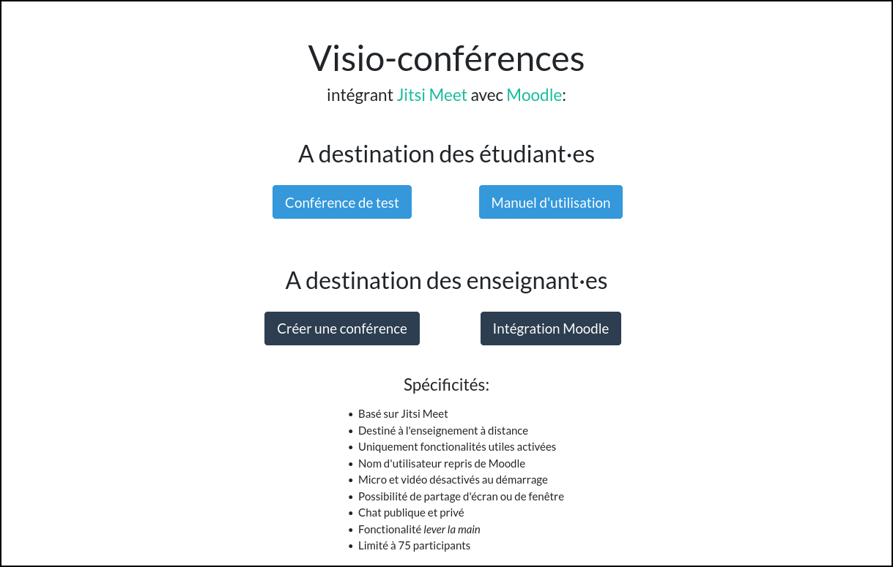
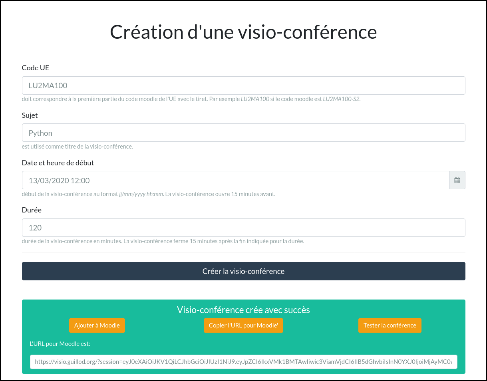
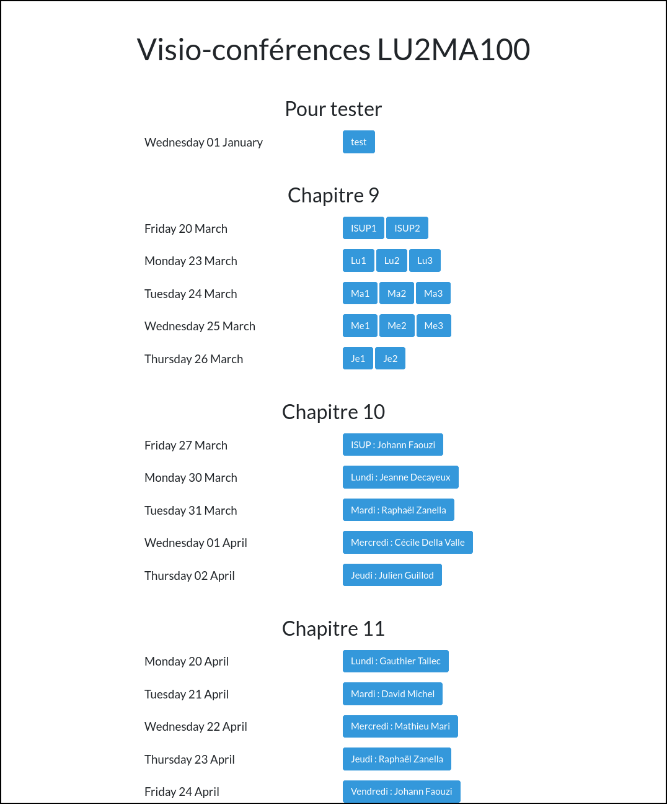

# Basic website for videoconference teaching

Basic PHP website to integrate [Jitsi Meet](https://meet.jit.si/) videoconference to Moodle, used at [Sorbonne University](https://www.sorbonne-universite.fr/) during the COVID-19 pandemic.

## Description

Ugly PHP website to manage [Jitsi Meet](https://meet.jit.si/) videoconferences and integrate them with Moodle. Was used during the spring semester 2020 at the Mathematics Department of [Sorbonne University](https://www.sorbonne-universite.fr/).

Use JWT (JSON Web token) provided by [php-jwt](https://github.com/firebase/php-jwt).

Sessions defined in the `data/` directory can be listed by passing variables, like:
https://visio.guillod.org/?id=LU2MA100-S2&name=28618809&nid=28618809

The whole interface is written in French but it should be easy to adapt it to another language.

* Based on Jitsi Meet
* Designed for distance learning
* Only useful features enabled
* User name taken from Moodle
* Microphone and video disabled at startup
* Possibility to share a screen or a window
* Public and private chat
* Raise your hand functionality
* Limited to around 75 participants
* Manual included on index page

## Configuration

* No database required
* Basic configuration file: `config.php`
* Sessions list: `data/`

## Screenshots

    
    
<em>Landing page suitable for both students and teachers.</em>

    
    
<em>Interface to create a videoconference. Instructions to integrate to Moodle are included.</em>

    
    
<em>Landing page for sessions when coming from Moodle.</em>

## Author

    Julien Guillod
    julien.guillod CHEZ sorbonne-universite.fr
    https://guillod.org/
    Mathematics Department
    Sorbonne University
    France